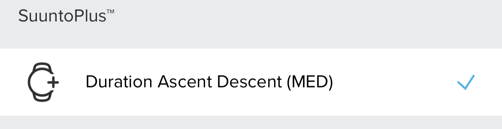

# Indoor Climbing
Suunto App Indoor Climbing Beta Version

TThis app is designed to show the meters climbed on each Ascent/Descent or climbing route without gps(Indoor Climbing). It shows the time spent on the ascent, ascent and descent, the meters climbed and the number of attempts/runs. Saves in the SA the number of times we completed ascent and descent in a training. And it generates a lap every time you finish the route or ascent/descent (you can also force that you have finished the ascent/descent or route by pressing the lap button).

### Screen Design:
    

 
 
### SA Outputs:
  #### Suunto Plus Metrics to analize later in SA
  
    
   
  #### SA Summary Outputs

  
## To be Fixing:
  - The Screen Medium UI2 fix the position of icons
  - The Medium UI2 Plus fix the position of icons

## To be improve:
  - Add a second condition to count the number of ascents/descents, use for example if the descent time is not increased for a few seconds. 

## I will Try to do it if possible:
  - Add an inclination data , and if is posible save the inclination dada for each lap.
  - 15 different grading scales : https://www.guidedolomiti.com/en/rock-climbing-grades/

---
### :fire: My Stats :

