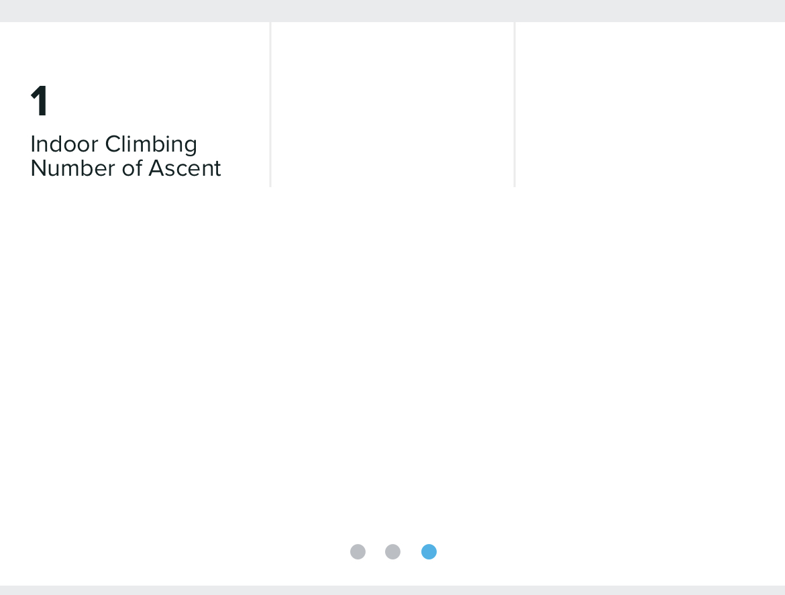

# Indoor Climbing
Suunto App Indoor Climbing 1.0 Version

This app is designed to show the meters climbed on each Ascent&Descent or climbing route without gps(Indoor Climbing). It shows the time spent on the ascent, the time spent on Ascent&Descent, the meters climbed and the number of attempts/runs. Saves in the SA the number of times we completed Ascent&Descent in a training. Saves in SA Suunto Plus the time that you spend in Ascent and the time spend for each Ascent&Descent. Generates a lap every time you finish the route or ascent/descent ***(you can also force that you have finished the Ascent/Descent or route by pressing the lap button).***

### Screen Design:
    

 
 
### SA Outputs:
  #### Suunto Plus Metrics to analize later in SA
  
    
   
  #### SA Summary Outputs
  
    
   
## To be improve:
  - More precision in climbAngleAscent, because it uses the distance without GSP.

## I will Try to do it if possible:
  - 15 different grading scales : https://www.guidedolomiti.com/en/rock-climbing-grades/

---
### :fire: My Stats :

