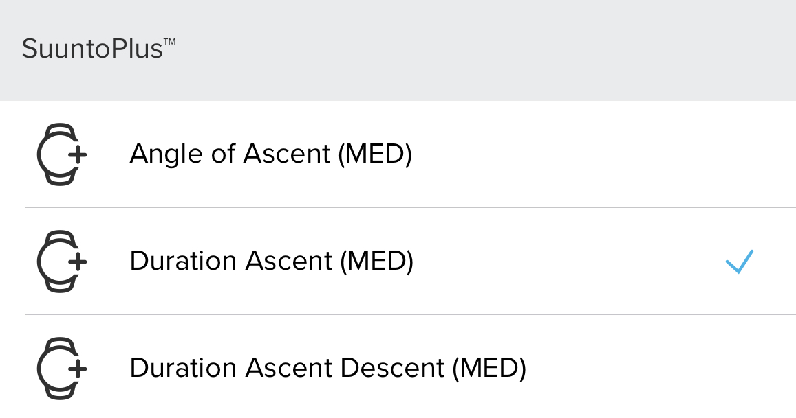

# Indoor Climbing
Suunto App Indoor Climbing 2.0 Version

This app is designed to show the meters climbed on each Ascent/Descent or Climbing route without gps(Indoor Climbing). It shows the time spent on the Ascent, the meters Climbed and the number of Attempts/Run plus the Climb Angle Ascent. Saves in the SA the number of times we completed Ascent/Descent in a training. Saves in SA Suunto Plus the time that you spend in Ascent and the time spend for each Ascent/Descent plus the Climb Angle Ascent. Generates a lap every time you finish the route or Ascent/Descent ***(you can also force that you have finished the Ascent/Descent or route by pressing the lap button).***

Other point of view is that this application can be used for training running up and down stairs with GPS.

### Screen Design:
    

 
 
### SA Outputs:
  #### Suunto Plus Metrics to analize later in SA
  
    
   
  #### SA Summary Outputs
  
    
   
## To be improve:
  - More precision in climbAngleAscent, because it uses the distance without GSP.

## I will Try to do it if possible:
  - 15 different grading scales : https://www.guidedolomiti.com/en/rock-climbing-grades/

---
### :fire: My Stats :

